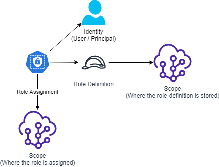
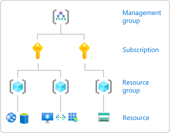
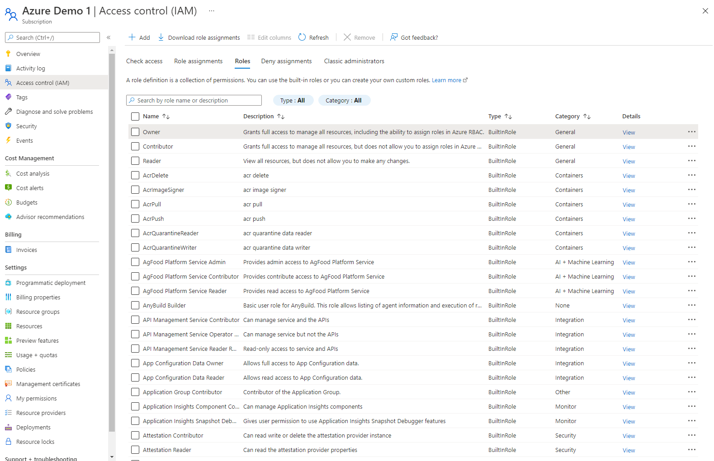

--- 

title: "Azure Roles" 

date: 2022-02-12T10:10:45+01:00 

draft: false

comments: true 

toc: false

images:

tags:
  - Azure
  - Bicep
  - PowerShell
--- 



In Azure, access and control of any resources is managed through *Role based access control* (RBAC). By being assinged a role, a user will be able to access or manage different aspects of a resource and it's subordinate resources.

## This guide depends on the following:

|Tool | Link |
| ----------- | ----------- |
|Azure Bicep Cli | [Bicep Cli install instructions](https://docs.microsoft.com/en-us/azure/azure-resource-manager/bicep/install)|
|VSCode + Bicep Extension | [Getting Up And Ready With VSCode](/blog/posts/gettingupandreadywithvscode/) and [VSCode Productivity hints](/blog/posts/vscodeproductivity/)|
|Azure Powershell | [Setup Azure Powershell ](/blog/posts/setupazpowershell/)|
|Azure Account | [Register Free Azure Account ](/blog/posts/RegisterFreeAzureAccount/)|

# Scopes
The roles will be given permissions on a *Scope*. To determine what a user is authorized to do in a specific scope, Azure checks what roles assignments are made to the scope you are trying to access. 

Scopes can be anything from an entire tenant to a managementgroup, subscription, resourcegroup or resource, basically anything you can manage in Azure. These are referred to as the resource Id.



Read more about scopes at [Microsoft Docs](https://docs.microsoft.com/en-us/azure/role-based-access-control/scope-overview#:~:text=In%20Azure%2C%20you%20can%20specify,of%20these%20levels%20of%20scope.)

# Role Assignments and Role Definitions

Role assignments are the components that tells Azure what permissions a user (identity) has been granted to a scope. 


The Role assignment itself basically just links a *role definition* and a *principal* (identity) to a *resource scope*. The actual permissions are defined in the *role definition*. There can be many role assignments made for a single role definition.

All role assignments and role definitions in a certain scope, can be listed by simply looking in the Azure portal under Access control (IAM), this applies to almost any type of object you can manage in the portal.



- You can see all assignable role-**assignments** in a scope by clicking the *Role assignments* tab. 

- You can see all assignable role-**definitions** in a scope by clicking the *Roles* tab in the *Access control (IAM)* page. 

# Role assignments

Open a subscription in your Azure environment and open the *Access control (IAM)* page and the *Role Assignments* tab. Here all the role assignments made for this scope will be listed. You can see in the *Scope* column where the role that applies for this subscription was assigned. If you don't already have any assignments directly to this resource, try adding one by clicking the *+ Add* button to make a new role assignment. Select the *Owner* role, click next, click *+ Select members* and then add your own account, finish by clicking *Review + Assign*. When the assignments is ready you should see it in the list.

## Let's check the properties of this role assignment!
The portal shows a subset of the properties of the role assignment, you can get more properties by using the Azure resource manager (ARM) API, the simplest way is by using either Azure Cli or PowerShell.

To get all the role assignments for your subscription, use the PowerShell command below. The *Scope* should be a resource identifier, for a subscription it looks like this: */subscriptions/00000000-0000-0000-0000-000000000000*.

**Replace the zeroes with your subscription Id.**

**PowerShell**
```PowerShell
#List all role assignments in a given scope
Get-AzRoleAssignment -Scope '/subscriptions/00000000-0000-0000-0000-000000000000'
```

You can see that each role assignment has a bunch of properties and that it's identified with a unique RoleAssignmentId, note that the scope for the role assignment is a part of the RoleAssignmentId, this means that you can use the same roleassignment template for many different scopes.

To get the JSON representation of the role assignment you can use the *ConvertTo-Json* cmdlet and you can then output it to a file.

**PowerShell**
```PowerShell
Get-AzRoleAssignment -ObjectId '00000000-0000-0000-0000-0000000000' | ConvertTo-Json | Out-file -FilePath '.\roleassignment.json'
```
## Making a role assignment

You can make a new role assignment using Azure Cli or PowerShell cmdlet *New-AzRoleAssignment*. However you can also make an ARM or Bicep template to deploy the role assignment, to save it in your repository "as code". I've made an [example](roleassignment.bicep) with **Bicep**.
#### name:
This is the name of the role assignment and must be a globally unique identifier (GUID). Best practice is to create a GUID using the scope, principal ID, and role ID together. You can use the bicep function *guid()* to generate a guid from the three values. If you plan to assign the role to a different scope that subscription, like a management group or resource group, you just replace the *subscription().id* with *managementGroup().id* or *resourceGroup.id() and change the *targetscope* accordingly.
#### properties:
##### **principalId:**
This is the Id of the principal (user account or managed identity) that you want to give permissions to. Here represented by a parameter.

##### **roleDefinitionId:**
This is the Id of the role definition you want to apply for this user, here represented by a parameter.

### Deploy the Assignment

```PowerShell
$Parameters = @{principalId = '00000000-0000-0000-0000-000000000000'; roleDefinitionResourceId = '/providers/Microsoft.Authorization/roleDefinitions/8e3af657-a8ff-443c-a75c-2fe8c4bcb635'; }

Set-AzContext -SubscriptionName 'Your Subscription displayname'

New-AzSubscriptionDeployment -Name 'Deploy_roleassignment' -Location 'WestEurope' -TemplateFile 'roleassignment.bicep' -TemplateParameterObject $Parameters

```
# Role Definitions

You can see all assignable role-definitions in a scope by clicking the "Roles" tab in the *Access control (IAM)* page. By clicking the (Details) "View" link on the right you can see the permissions of a role. If you then click the "JSON" tab, you will see the JSON representation of the role, this is basically what you will use when you make new role-definitions as code.

**You can retrieve them with PowerShell, just like you did with the role assignments.**
```PowerShell
#List all role definitions in a given scope
Get-AzRoleDefinition -Scope '/subscriptions/00000000-0000-0000-0000-000000000000'
```

To get the role definition for a single role as JSON to a file.

```PowerShell
Get-AzRoleDefinition -Name 'owner' | ConvertTo-Json | Out-file -FilePath '.\ownerdefinition.json'
```

## Let's look a the JSON on the bult-in 'owner' role!

#### Name:
The displayname for the role definition.
#### id:
This is the Unique Identifier for this role-definition. This id is used when doing a role-assignment.

#### properties:
##### roleName:
The displayname of this role, please note that it is not unique, that means that two different role-definitions with the same name can be defined in two different scopes.

##### description:
A freetext description field that should briefly and simplified describe what permissions this role gives.

##### assignableScopes: 
This is a list of all the scopes where this role definition can be assigned. Microsoft uses this property in to enable moving resouces between different scopes without having to make new role-definitions and assignments, in short - use the scope you are deploying the role definition to unless you are migrating things. This list is a JSON array, all scopes will be listed within the *[]*.

##### permissions:
In this key you will define the actual permissions that the role gives. Note that the permissions key is a JSON array [ ], with (theoretical) possibility to have more than one list of permissions. However I have never tried to pull off that stunt. 

Every key in a permissions item is another JSON array [ ], which means that you can make lists of *actions*, *notActions* etc.

- **actions** lists all the actions that this role can make, for the *owner* role this is just the wildcard * for everything.
- **notActions** lists every action that you explicitly want to deny from this role, by listing things here, you can take away some of the permissions that were listed in *actions*.
- **dataActions** lists all the dataActions that this role can make, this controls what the role can do with the data inside a resource, for example access to the files in a storage account. In Azure the controlplane for resource objects is separated from the dataplane in the resources.
- **notDataActions** lists every dataAction that you explicitly want to deny from this role, by listing things here, you can take away some of the permissions that were listed in *dataActions*.

# Custom Role definitions
There might be reasons you want to make your own custom roles to limit the amount of permissions you give away in your organisation. For example you may not want your application teams to be able to cancel, rename, or create subscriptions on their own, or even move them into another organisations Azure Active directory tenant.

Craft your role definition to you liking and then you can push it to Azure, either by using the Azure portal, ARM Api, Cli or PowerShell.
Here is a [Custom Owner](customowner.bicep) role to give you a **Bicep** example to start from. Basically what you see in this file is the same properties that you saw when listing a role definition with PowerShell, with the difference that the Id is not yet determined. If you need some inspiration for permissions, view a role in the Azure portal and check the permissions tab, here you can search actions and dataactions.

## Deploy the bicep role definition

```PowerShell
$Parameters = @{roleName = "Custom Owner"}
Set-AzContext -SubscriptionName 'Your Subscription displayname'

New-AzSubscriptionDeployment -TemplateParameterObject $Parameters -TemplateFile 'customowner.bicep' -Location 'WestEurope'
```

I recommend deploying role definitions to Scopes high up in your structure, preferably to management groups. The role definitions can then be assigned in any subordinate scopes.

To deploy the same role defintion to a managmentgroup you must change the **targetScope** to 'managementGroup', replace *subscription().id* with *managementGroup().id* in both **roleDefName** declaration and **assignableScopes**.[Like This!](customownerMgmtGroup.bicep) Then you run the following PowerShell:

```PowerShell
$Parameters = @{roleName = "Custom Owner"}

New-AzManagementGroupDeployment -TemplateParameterObject $Parameters -TemplateFile 'customownerMgmtGroup.bicep' -ManagementGroupId 'Corp' -Location 'WestEurope'
```

# Conclusion
This was how you can define and assign roles in Azure. By using code you can automate the assignments and in a later blogpost I will also cover how you can use Azure Blueprints to make the role assignments as part of your landing zone deployments. These techniques can be another piece of the puzzle to automate your subscription deployment process. 

**Please follow me on [LinkedIn](https://www.linkedin.com/in/peter-the-automator/) and let me know if you like my blog.**

