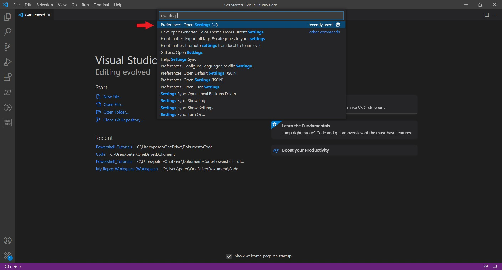
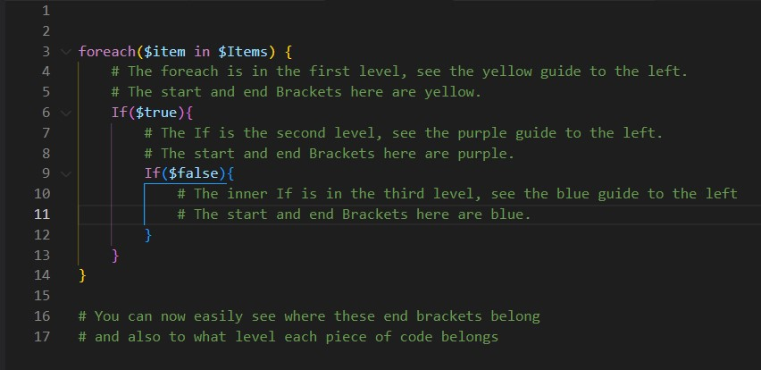

--- 

title: "Getting up and ready with VSCode" 

date: 2021-12-12T09:48:44+01:00 

draft: false

comments: true

images:

--- 

When you are authoring or editing any type of code or markdown text, VSCode can be a powerfull ally. It will give you syntaxt highlighting and intellisense for most modern programming languages and there is a wide set of extensions to make your life easier. If that wasn't enough, VSCode also has built-in support for Git, meaning that you don't need to learn all the Git commandline syntax and you get a visualization of your branches, commits, staged changes and stash. It also has a debugger to help you debug your code.

VSCode is open-source, developed and maintained by Microsoft with support from a vibrant community. The fact that it's free with no need for a license and at the same time very powerful has made it a immensely popular code editor. It's also the editor provided in Github Codespaces and also available in the Azure Cloud Shell.

## Installation
You can download VSCode from [https://code.visualstudio.com](https://code.visualstudio.com/) and the installation can be done **without** any administrator equivalent privileges.

## First some useful settings
To open settings first bring up the VSCode command mode by pressing Ctrl+Shift+P, the write *Settings* and select *"Preferences: Open Settings UI"* from the list.

Go down to the *Text Editor* menu item, Now find the setting *Bracket Pair Colorization:* **Enabled** and tick the box.
Next go down to *Guides: Bracket Pairs* - Set it to True
This will give all your bracket pairs different colors and also show a guide that visualises the level you are on in your code.

## Extensions
There are tons of useful extensions for VSCode, and I use more than I write in this list depending on what kind of project I'm working on. Too many extensions may slow VSCode down and sometimes the effects are not very good, try to keep it civil... For my series of blogposts I'll recommend as a minimum to have at least:
- **Powershell** Your essentials for the Powershell language, Debugger, Intellisense, Syntax highlighting, integrated console and more.
- **Bicep** A must have when authoring Azure Bicep templates, provides Intellisence, Syntax Highlighting and more.
- **Path Intellisense** VSCode helps you with autocompleting paths in your code, as long as the path is relative in your local filesystem.
- **GitLens** Visualises Git for you, totally recommend it for anyone that isn't well versed with the Git cli.
- Bracket Pair Colorizer is really nice, but you don't really need it if you have done the bracket settings I've shown. I don't use it anymore.

Now you should have VSCode ready for your first steps with Powershell and Azure.

**Next we'll do some Git basics in VSCode! Happy Coding!**

/TheAutomationDude

