--- 

title: "Install Git version control on a Windows PC" 

date: 2021-12-07T17:44:31+01:00 

draft: false

comments: true

images:

--- 

Whether you are developing applications, scripts or authoring Infrastructure As Code such as ARM, Bicep, Cloudformation, Google Cloud Deployment Manager or Terraform  -templates, version control is important and at the heart of the DevOps toolkit. The most popular and widely adopted version control tool is Git, developed by Linus Torvalds – the inventor of the Linux kernel.

If you work in VSCode, you won't need to learn the git-cli commands, since VSCode has built-in support for git.

## Here is a simple guide to installing git on a Windows operating system.

Download the git installer from [https://git-scm.com/downloads](https://git-scm.com/downloads) and start the installation.

In the first Screen there is a some information about the GNU public license, just click 'Next' (or read through it if you wish).

### Git components to install
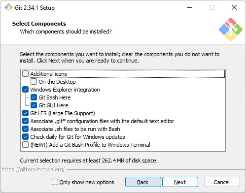

I ususally just accept the default components and click 'Next'.

### Text editor for git
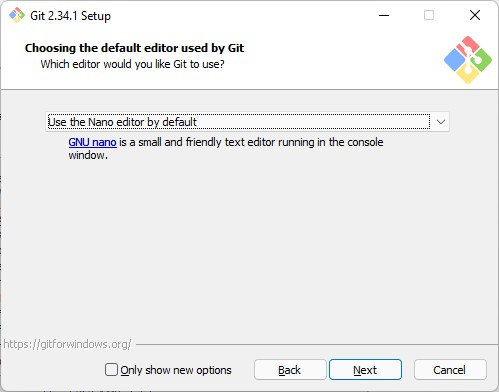

This sets what text editor git will use when you need to resolve things like merge conflicts. I prefer to use the nano editor for git, vim is a steep learning curve if you are not used to it. Since I use the VSCode support, this setting doesn't have much effect.

### Default initial branch
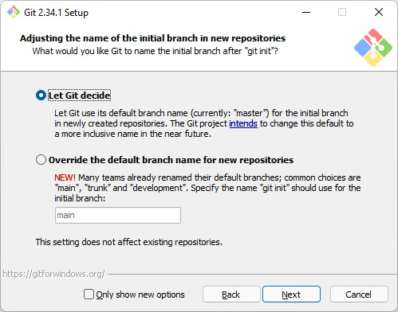

Let Git decide the name of the intial branch in newly created repos (master is default for now, but both master and main are commonly used)

### PATH Variable modifications
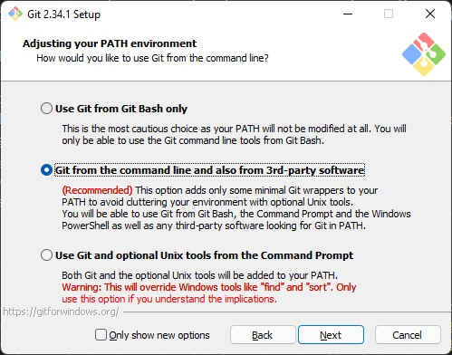

Now you get the question how you want to use git (what modifications git will do to your PATH variable), you should use the recommended setting since you want to be able to use git in your powershell session and VSCode.

### SSH Client
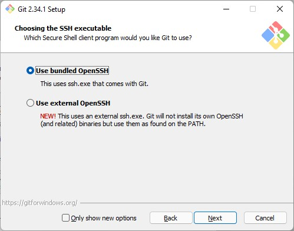

Next choice is the secure shell (ssh) client to use, unless you have another installed I suggest you use the OpenSSH client bundled with git.

### SSL/TLS
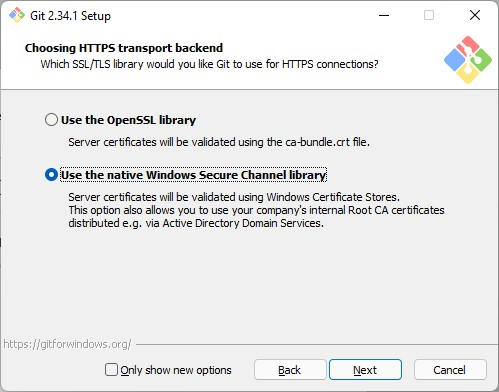

Now you can choose what ssl/tls library to use for webrequests. If you want to make use of the the internal company CA certificates and trusted roots I suggest you use the native windows certificate store.

### Line endings
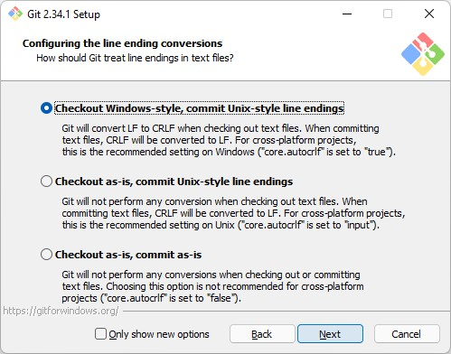

If you didn't already know, different operating systems use different control characters to end a line, this actually goes back to the era of the mechanical typewriter, Scott Hanselman explains it very well in this [Video](https://www.youtube.com/watch?v=TtiBhktB4Qg). 

In short Windows uses CR (Carriage Return)) + LF (Line Feed) while the Linux and Unix family uses only LF and some Apple operating systems use only CR. What a complex world we live in!

Now git will help you with converting new lines to be compatible with other operating systems. Use the recommended setting to have your code being committed to the repository with the LF, and checked out with CR+LF. This will be seamless to you, everything will be just as usual while you work on your Windows operating system, it's like magic!

### Terminal emulator
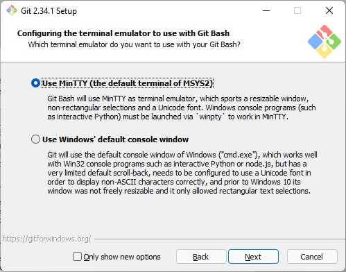

Since I don't use git bash, this makes no real difference to me, so I use the default MinTTY.

### Git pull behaviour
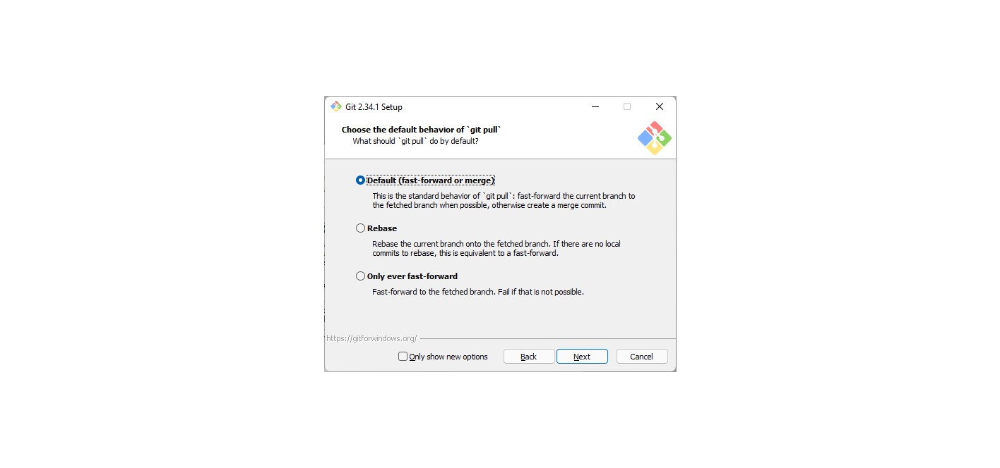

To understand this setting you need to dive into the strategies that git has for pulling and merging changes between branches. The default setting is to Fast-Forward or Merge and you can safely use that setting.

### Credential manager
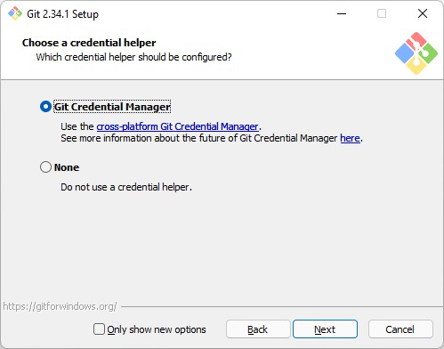

I haven't used the git credential manager so far, but I let git install it anyway.

### Extra options
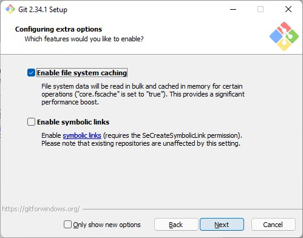

### Experimental options
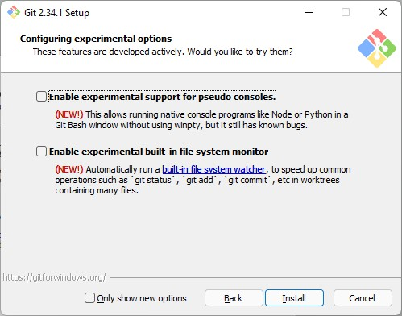

Now you can click install and get on with your life!

**Next is setting up VSCode and cloning your first repository, stay tuned for the next blogpost!**

/TheAutomationDude

