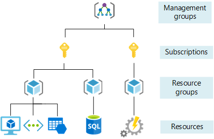

--- 

title: "Azure Management Groups, as Code" 

date: 2021-12-27T11:24:06+01:00 

draft: false

comments: true 

toc: false

images:

tags:
  - Azure
  - Bicep
  - PowerShell
  - MicrosoftCloudAdoptionFramework
  - EnterpriseScale

--- 

# ManagementGroup Structure
ManagementGroups are basically containers that contains your organisations subscriptions.
By defining Roles and Policies and assigning those on a ManagementGroup, the definitions and assignments of those will be inherited down the hierarchy to other management groups subscriptions, resourcegroups and finally resources. 


 
 For enterprise scale Azure environments this is a very good governance tool. The management group structure cascades down from the "Tenant Root Group" which is the first Management group that Azure automatically creates for you, **this group cannot be deleted and will allways be the top scope**.

## The Microsoft Cloud Adoption Framework
Microsoft has developed architectural guidelines for cloud adoption - the [Microsoft Cloud Adoption framework](https://docs.microsoft.com/en-us/azure/cloud-adoption-framework/) which is a proven framework for successful cloud adoption. I strongly recommend that you give it a good read before implementing Azure for an organization. Bundled with this is also a lot of templates and artifacts that you can use as base for your Azure landing zones, have a look at this [Enterprise Scale Github repository](https://github.com/Azure/Enterprise-Scale). This will give you the foundation from where you can define your Azure Landing Zones - the templates for any new subscriptions you issue for your organization. 

## Defining your Management Group Structure - as code
You can build your management group structure from the Azure portal, but by defining it as code, you will get a version controlled, modular and reusable deployment method.

The management group structure we will deploy for lab purposes will be based on one that Microsoft have examplified in the picture below for Microsofts favourite example organization - *Contoso*. You can modify this structure to fit your organization, but I recommend you to stay as close to the Microsoft model as possible.


I've made an [Azure Bicep](https://docs.microsoft.com/en-us/azure/azure-resource-manager/bicep/overview) file that represents the modified deployment we will to make to the tenant root group. 

I've prepared a [bicep file](main.bicep), but I suggest you just use it as support for writing your own file, just to get the hands on practice with Bicep and VSCode.

#### targetScope
The file starts with the statement `targetScope = 'managementGroup'`, this tells Bicep that this deployment is going to be deployed to the management group scope, and the syntax used in the template will be analyzed from that perspective. If you start typing `tar` and press `Ctrl+Space`, the VSCode Bicep extension intellisense will suggest the word `targetscope`, accept it by pressing enter.


To get the syntax in VSCode with the bicep extension you can write the keyword like `targetscope =`.
VSCode will suggest `'managementGroup'` if you press `Ctrl+Space`, you scroll down with your arrow keys and accept the suggestion by pressing enter.

### resource
Next you need to define your organizations top level management group that will be deployed in the Tenant Root Group. Start by typing the keyword `resource`, if intellisense pops up the word for you, just accept the suggestion with enter. 

Next add the name for this bicep resource, I'll use the same name (MyOrgName) for the resource as the name for the managment group. Other related resources can refer to properties of this resource by referencing the resourcename.propertyname, it will be clearer as we move along. You can use your organisation name like Microsoft have used the "Contoso" in their example.

Next you press `Ctrl+Space` to select the resource type. You can start typing `managementGroups` or simply scroll all the way through the list with arrowkeys and `PageUp` / `PageDown` keys until you find the resource. Confirm the list-item with the `Enter` key. Next VSCode should ask you for the API-version, if not you just press `Ctrl+Space` to get that syntax suggestion. I usually choose the latest API-version. Just keep using `Ctrl+Space` arrowkeys and enter to get the syntax suggestions for `=` and `required properties`. 
#### Name
Now you should have the `name:` tag there encapsulated by `{ }`. Enter a name for your top management group (I used 'MyOrgName') encapsulated by `' '`.
#### Scope
In the line after the `name` tag, press `Ctrl+Space` and select `scope`, then use the tenant() *function* as scope. 
#### Display Name
Keep using the `Ctrl+Space`to build the resource definition. The `displayName`is a subkey to the `properties` key and can be the same as `name` or a more verbose descriptive name that will be shown in the overview in the Azure portal. The `name` is the unique identifier for this management group. 
#### Parent
The parent key is a reference to where in the management group structure this management group will be located. By referencing the id of the parent management group it will be a child to that one. 

**Now things might get a little confusing, but the Bicep extension will help you getting things right!** (Doing the same thing with ARM-json is much worse, I promise!)

You will reference the **management group id** in the `id` key which is a subkey to the `parent` key. The *parent* key is inside the `details` key which is inside the `properties` key. You get a lot of navigation assistance for the hierarchy of the Bicep code from the indentation, bracket colors and the guides to the left.


To specify the id of the target management group for this deployment (in this case the Tenant Root group) you can use the Bicep function `managementGroup().id`.

### Next resource
When you are done with the first management group you just repeat the same procedure again (hint, use copy paste and modify some fields). The name for the bicep *resource*, and the tags `name`, `displayname` and `id` are the values you need to change for each management group resource you define. All the `id` tags for the `parent` property is now referencing slightly different. Instead of using the `managementGroup().id` function, you reference the object `id` property of the parent management group you want the resource to child of with dot-referencing the `id` property of the parent object; `id: MyOrgName.id`. For a child of the **'Platform'** management group the reference would be `id:Platform.id` instead. It's as easy as that!

## Deploying the management groups
When your file is completed and free of errors you can deploy it with PowerShell or Azure cli, I prefer PowerShell so that's what this guide will use.

## Find the Tenant ID
```Powershell
Connect-AzAccount
$Tenant = Get-AzTenant
$ManagementGroup = Get-AzManagementGroup $Tenant.TenantId
```
You can now check the details for your top level Management Group stored in the *$Managementgroup* variable.

```Powershell
$ManagementGroup

Id                : /providers/Microsoft.Management/managementGroups/xxxxxxxx-xxxx-xxxx-xxxx-xxxxxxxxxxxx
Type              : /providers/Microsoft.Management/managementGroups
Name              : xxxxxxxx-xxxx-xxxx-xxxx-xxxxxxxxxxxx
TenantId          : xxxxxxxx-xxxx-xxxx-xxxx-xxxxxxxxxxxx
DisplayName       : Tenant Root Group
UpdatedTime       : 2021-12-28 17:31:33
UpdatedBy         :
ParentId          :
ParentName        :
ParentDisplayName :
```

## Deploying
```Powershell
New-AzResourceGroupDeployment -ManagementGroup $ManagementGroup -Templatefile ".\Main.bicep"
```


# Move the existing subscription into a management group
