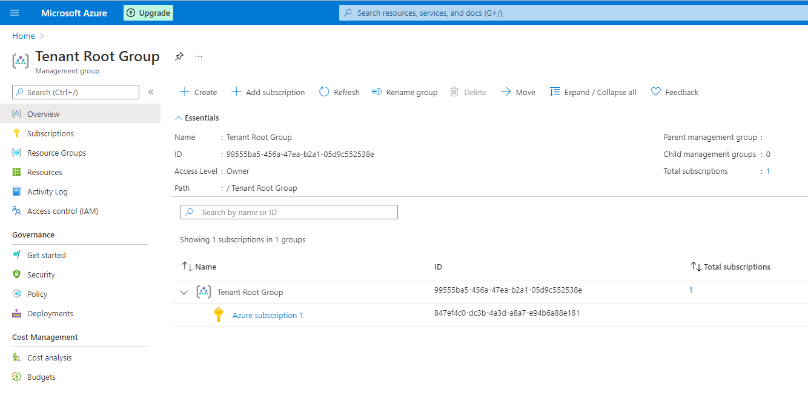
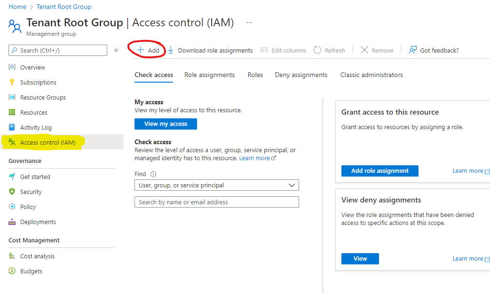

--- 

title: "Register and setup a free Azure Account" 

date: 2022-01-10T21:03:06+01:00 

draft: false

comments: true 

toc: false

images:

tags:
  - Azure
  - Azure AD

--- 

1. Register a Microsoft account
If you don't have a Microsoft account or simply want a separate account for learning, go to [https://outlook.live.com/](https://outlook.live.com/) to register a new account.

2. Install Microsoft Authenticator on your mobile device [https://www.microsoft.com/en-us/security/mobile-authenticator-app](https://www.microsoft.com/en-us/security/mobile-authenticator-app)

3. Sign in to your Microsoft account. Click the account icon in the top right corner of outlook and enter the profile settings for your account. Then choose Security from the menu in the top of the page. Click *Add a new way to sign in or verify* and then select *Use An App*. Open Microsoft Authenticator and follow the steps to add this as authentication for your account.

4. Go to [https://azure.microsoft.com/](https://azure.microsoft.com/) and click the *Free Account* button. Register the new Azure account with your Microsoft account. Microsoft requires a credit card to verify your identity, no money is drawn from the card, the card details are just validated. Once you have completed the registration process your Azure Account is ready for use.

# Managing access
### The Global Administrator role
The new Azure Active Directory tenant that has been created for you only has one user account to start with, the user account you used to signed up for Azure. This account has the Azure AD *Global Administrator* role, this role gives the user the privileges to manage identities and role assignments in Azure Active Directory, but by default no privileges are granted to anything else in Azure like *management groups*, *subscriptions*, *Resource groups* or any type of resources. 

### Separation of duties
Normally you would delegate the different roles to users with the responsibility to manage pieces of your Azure account, in order to separate duties and reduce the impact if a privileged identity gets compromised.

There are roles to administer the **identity** aspects of Azure (Azure Active Directory), like *User administrator*, these would be delegated to a helpdesk or access management team in a traditional It organization. These roles does not have any privileged access to the Azure resources in the account.

There are also Azure roles like *User Access Administrator* or *Owner* that have **access to resources** in the account, like Management Groups, Subscriptions, and all subordinate scopes. These roles has no privileged acces in Azure Active Directory. These roles can be used to delegate access control to Management groups, Subscriptions, Resource Groups or any Azure resources such as Virtual Machines, Storage, Networks, Containers, Functions or Apps, typically delegated down to your development teams.

The *Global Administrator* role is very powerful and can gain access to all other roles in your account by elevating access, this account must be well protected and should only be used for the very few tasks that require this role.

# Elevate your account 
You can elevate your *Global administrator* to give it access to the resources in Azure. Open [Azure Active Directory Admin Center](https://aad.portal.azure.com/) and follow the instructions in [https://docs.microsoft.com/en-us/azure/role-based-access-control/elevate-access-global-admin](https://docs.microsoft.com/en-us/azure/role-based-access-control/elevate-access-global-admin). (While you are at it, you can also set your custom name for your tenant) Basically you will elevate your user account to *User Access Administrator* in the root of the tenant in order to later assign roles to other users Management Group structure. 


### Enable Management Groups
In the portal, write "Management Groups", to get to the Management Groups blade. Azure will ask if you want to start using management groups, and yes, that is exactly what you want. Enable management groups and then click the *Tenant root group*. 

Next you select *Access control (IAM)* and then *Add*, *Add role assignment*. 
Select the *Owner* role and then *Members*, now you can add the users that you want to have the *Owner* role for the *Tenant root group*, please be aware that they will have the owner privileges to everything in your Azure account, except Azure Active Directory. It's recommended to give this privilege only to the individuals that manages the management group structure and high level compliance like role and policy definitions. Then they can delegate the owner role on any scope under this one. Remember to follow the rule of least privilege access. 

To provide a user Owner privileges to the root of the tenant you can use Powershell.
#### I recommend the PowerShell method over using the Azure Portal, especially if you need to deploy Management Groups in the Tenant Root Group with PowerShell (I have experienced issues with trying to do it with the portal).

```Powershell
New-AzRoleAssignment -Scope '/' -RoleDefinitionName 'Owner' -SignInName 'usersigninname@thetenantname.onmicrosoft.com'
```
Remember to use the sign-in name you find for the user in the Azure Active Directory blade, since the sign-in name may differ if the user is created in another tenant from start.

For the purpose of learning and labs you can give all access to your single user, allthough that is not recommended for any production scenarios.

Once you have assigned the *Owner* role, you should go back to the Active Directory blade and disable the "Access Management for Azure Resources" to remove your account from the *User Access Administrator* role again. If you selected the same account as an Owner of the *Tenant root group*, you will still be able to manage resources in the account. If you selected another user, you will have to do any future steps in that user context instead.

You'll notice that Azure has created a single subscription that is now in the "Tenant root group*, we can move this subscription into a management group later on, when the management group structure is deployed.

**That's it! You now have an Azure account to start getting some hands-on training!**

Next we will [create a management group structure](/blog/posts/managementgroups/) as base of your Azure foundation!

**Stay tuned!**

/TheAutomationDude
