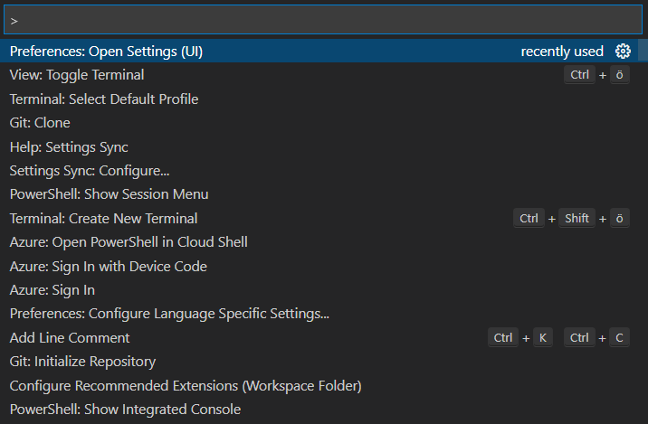
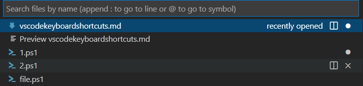
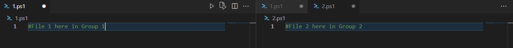
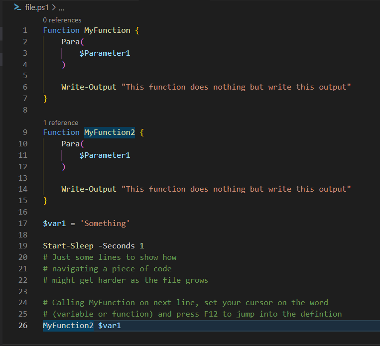
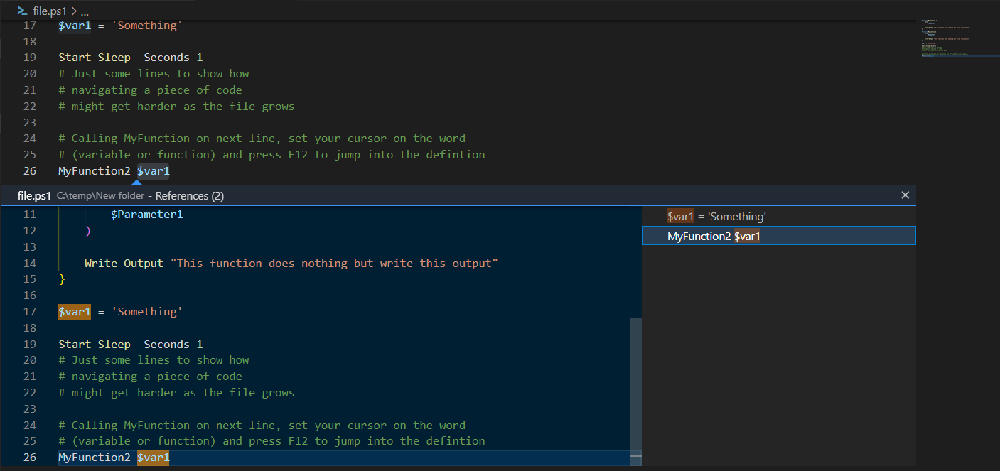
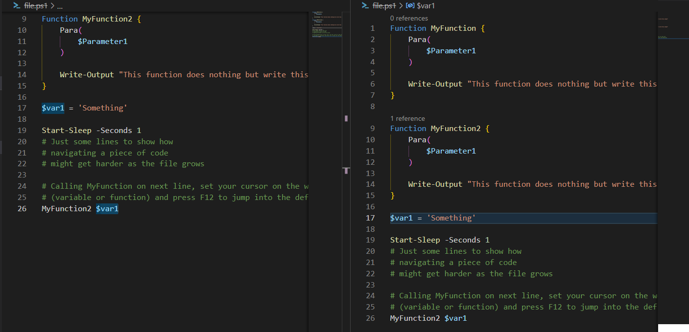

When you get used to VSCode you will experience a boos to your productivity. Some repetitive tasks when writing code are drastically reduced, with language support, intellisense and more, you don't even need to remember the syntax very well. Keyboard shortcuts is another important feature when coding, since you don't want to take your hands off the keyboard to use the mouse too often. 
## Keyboard Shortcuts
There is a keyboard shortcuts reference as [https://code.visualstudio.com/shortcuts/keyboard-shortcuts-windows.pdf](https://code.visualstudio.com/shortcuts/keyboard-shortcuts-windows.pdf), however these settings does not fit all keyboard layouts as they are for a US keyboard. 
To edit your keyboard shortcuts you can press `[Ctrl+Shift+P]` then type *"Preferences:Open Keyboard Shortcuts"*.  

Keybindings will differ between keyboard layouts, I'm using a Swedish keyboard layout, that differs quite from the american keyboard layout. Some non-US users actually buy US keyboards for coding just because some signs like  `[]' : /\ ` and are much more easy to access in the US layout.

With that said, I recommend you to check out the keyboard shortcut settings in VSCode to check out the keyboard shortcuts that comes with your keyboard layout, and customize them to be easily accessible for you.
## Show Command Palette
`[F1] / [Ctrl+Shift+P]` 

The command palette is essiential to many functions that you will use in VSCode, such as Git: Clone, Setting Preferences and Help.

## Quick Open, Go to File...
A quick way to open the file you want to work with.

`[Ctrl+P]` 

## Multi-line Editing and Find/Replace
The first two are very standard search and replace funtions. But when you have tried "replace in files", "insert cursor" and "Select all occurences of current selection" you will forever be annoyed with many other editors that miss this function. It's just very fast, useful and at the same time you get good control of what you are doing.
### Find
`[Ctrl+F]`
### Replace
`[Ctrl+H]`
### Replace in files
This is a multi-file replace, very useful, but be careful!

`[Ctrl+Shift+H]` 
### Insert Cursor
You can select and edit multiple lines simoultaneously, it's awesome, try it out! 

`[Alt+Click]` 

### Select all occurences of current selection
Just like you can set the cursor in multiple lines, you can select and edit all occurences of the string you have selected. Awesome when you have decided to rename something that is referred in multiple locations of your code. 

`[Ctrl+Shift+L]` 

## Cutting, pasting, Moving, Removing
### Moves row/section up/down
Instead of cut and paste you can move rows or sections of code up and down by simpler means. Great when you want to restructure things slightly.
##### *With my Swedish keyboard layout*
`[Alt+UpArrow] / [Alt+DownArrow]`
##### *With US keyboard layout*
`[Shift+Alt+UpArrow] / [Shift+Alt+DownArrow]` 
### Delete section
Deletes an entire row/section.

`[Shift+Delete]` 
### Cut line or highlighted area
Same as most windows based editors.

`[Ctrl+X]` 
### Copy line or highlighted area
Same as most windows based editors.

`[Ctrl+C]` 
### Paste
Same as most windows based editors.

`[Ctrl+V]` 
## Navigation
### Go to start/end of Line
`[Home] / [End]`
### Go to start/end of file
`[Ctrl+Home/End]`
### Scroll Up/Down
`[Ctrl+Up] / [Ctrl+DownArrow]`
## Split Editor
There are keyboard shortcuts for this one, but since I don't do that very frequently, I simply use the mouse to split the editor. 

### Focus into editor group 1/2/3
Your split editor has groups, use this command to shift focus between them. "n" is the number of your group, to shift focus to group 2 you press `[Ctrl+2]`

`[Ctrl+n]` 
## Jump to definition
This a super-useful feature, when you are on a line of your code and need to jump to the code section where used variable/object or function is being defined, you can mark the name of that variable/object/function and VSCode will jump the cursor into that definition.

Look at this example, I was standing on the word *MyFunction2* in line 26, marked *MyFunction2* and then pressed **F12**. VScode jumped to line 9 where *MyFunction2* is declared.  

`[F12]` 

  

If I would have been on the word *$var1* VSCode would have sent me to line 17 instead, where *$var1* was declared. Great isn't it!?
### Peek Definition
Maybe you just want to see the definition, not jump there... This brings up a quick peek window showing the definition, below your highlighted code. 

`[Alt+F12]` 

### Peek definition to the side
Now that feature gets even better! By pressing first Ctrl+K, then releas and press F12 VScode will open up the file with the definition in a new editor to the side and jump to the definition. Now you can compare how you call the function with how it was defined, very good for troubleshooting. 

`[Ctrl+K] [F12]` 

## Zooming in and out
You can adjust the amount of zoom to personal preference
On my keyboard it's just `[Ctrl+]` or `[Ctrl-]` to zoom in and out.