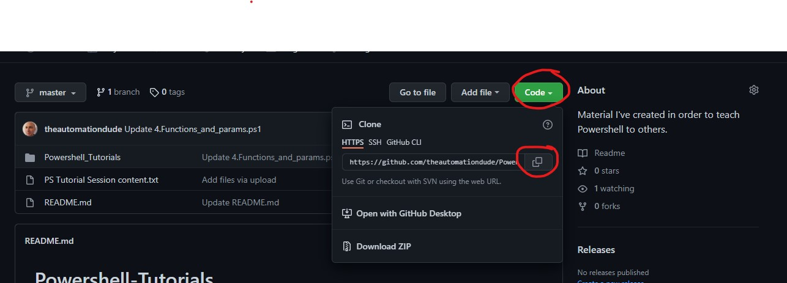
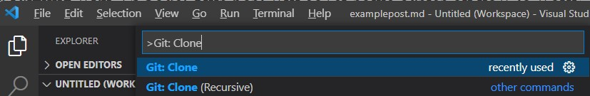
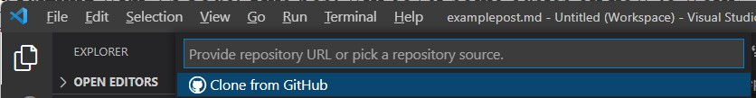
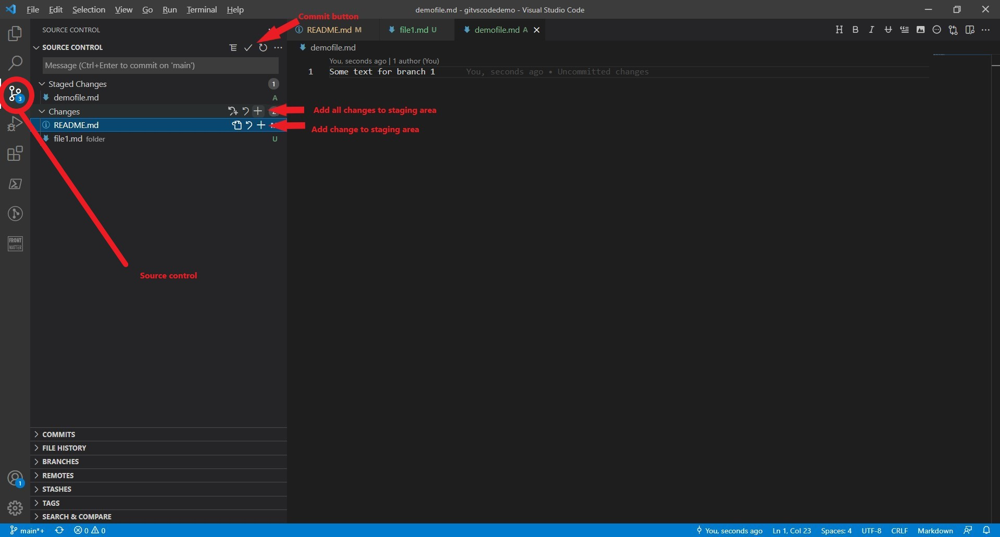
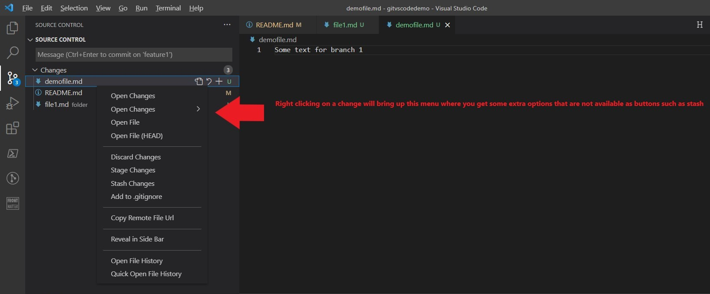
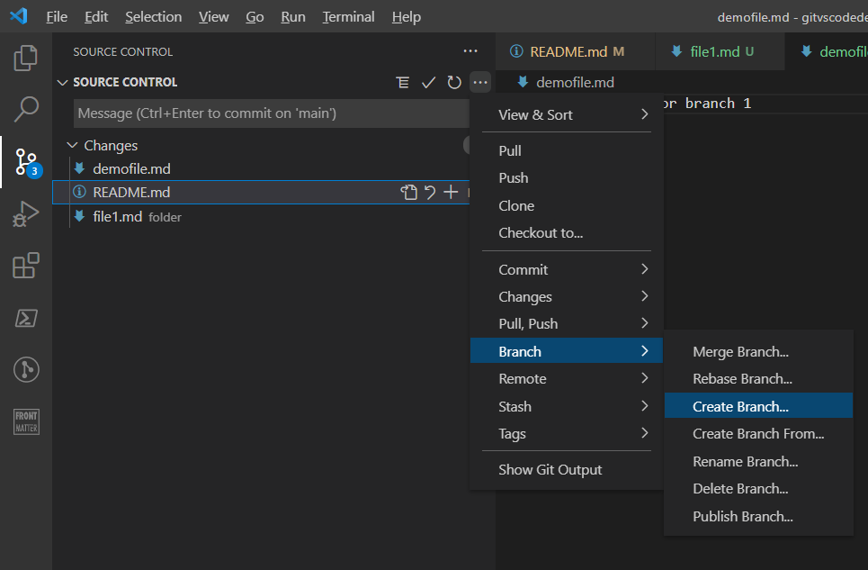
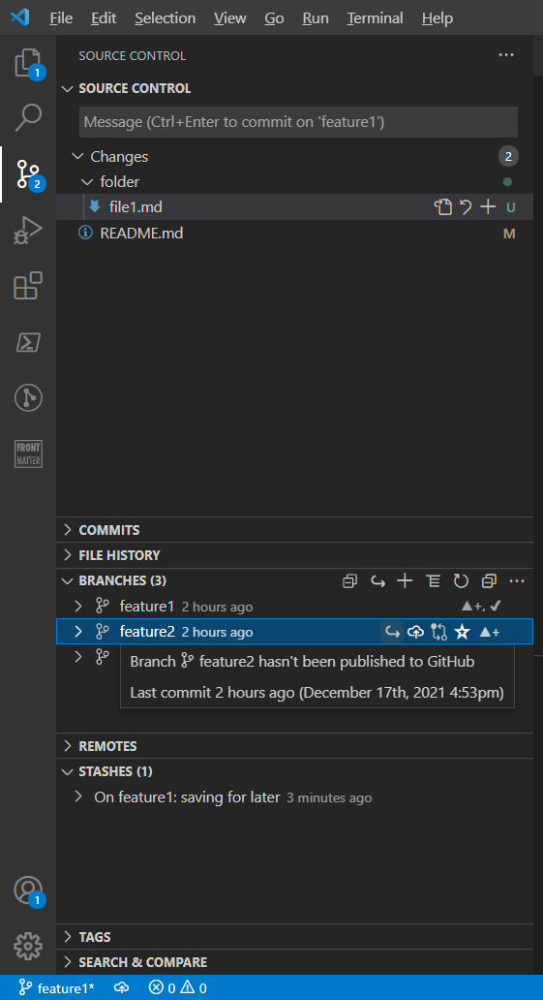

--- 

title: "Using Git version control in VSCode" 

date: 2021-12-16T21:48:27+01:00 

draft: false

comments: true

images:

--- 

In a previous post I wrote about how to [install git on the windows operating system](/blog/posts/installgit/). And another post was about how to [get up and running with VSCode](/blog/posts/gettingupandreadywithvscode/). This post will cover some basics on how to work with git, especially in VSCode.


To contribute to a software project, you can clone a repository and then push new code that you have authored to it. Normally this is done by working in different branches, where the main or master branch normally contains the version of the code that will be pushed to the production environment, while all developers work in other branches that get merged into the master/main branch. This way development can be version controlled and be tested without being introduced to the master branch before it's ready.

## Git config
To collaborate with others in Git you must first set some user settings. Open a shell (powershell, vscode integrated shell or the command shell), then type.

`git config --global user.name "My Name"`

(use your own name of course)

`git config --global user.email "my.email@domain.com"`

(use your own email of course)

## Getting the repository clone URL
Go to the repository you want to clone, in this tutorial I'll use Github, but it's pretty much the same in Azure DevOps and Gitlab (and probably all the other flavours of version control repository management services out there). 


In the repository you click the code/clone button, this will copy the clone URL that you will use in Git cli or VSCode. 



### Now you can either clone the repository by using Git command line interface (cli), or by using the VSCode graphical user interface (GUI). 

## Clone an existing repository with VSCode
In VSCode, you press *Ctrl+Shift+P* to open up the VSCode command palette.



Now type Git: Clone and then VSCode will ask you for the cloning url that you copied from the repository clone button.



 Paste the url in the box and then select the folder where you want to store your local replica of the repository, the repository will unpacked into a subfolder to this folder that has the same name as the repository. VSCode will ask if you want to add this repository to the current workspace or open it in a new window, personally I prefer using one window per repository that I'm working with.

## Clone an existing repository with Git cli
Use whatever command (or alias) that rocks your boat to set the folder where you want the repository to be cloned into as your current working directory. In this example we will clone to the *ClonedRepos* folder in the user home folder.

```shell
cd ~\ClonedRepos
```
or
```Powershell
Set-Location ~\ClonedRepos
```
(useful aliases for Set-Location are sl or cd)

#### Now clone the repo with the git clone command and pasting in the repository clone url.

```shell
git clone <your cloneurl pasted here>
```

## Using VSCode 
Most Git commands can be issued by using the GUI in VSCode source control. It's working well and you won't need to learn the Git syntax or commands, you can just focus on the concepts like branches, commits, stash, push, pull, merge etc. that Git has. I recommend anyone new to Git to go down the VSCode GUI route, just to get used to working with it and you can learn the Git cli later if needed. I don't use the git cli much at all, don't see much need for it. Here's some pictures showing the different buttons for the features that are described with git cli commands below.



By clicking the '+' symbol a change is added to the staging area. If you hoover over the change in the staging area a '-' symbol will show, clicking this moves the change back from staging to tracked changes. To add all changes you can select the + in the folder structure of the source control, or just make an empty commit, then VSCode will ask if you want to apply all changes in this commit.

By right clicking changes you get some additional options that don't have buttons. Also note that you can discard changes, that means that the changes are removed from the file(s), if you then save the file, the changes are lost forever...



By clicking the three dots '...' in the top of the repo control you get another menu with options such as creating and managing branches.



In the bottom you have expandable sections where you can view and manage your commits, branches, remotes, file history and stashes. For example you can switch branch, delete branches, apply stash and more. Some of these functions are also available in the main source control section at the top.



## Branches
By default you are working in the main or master branch. But best practise is to work with changes related to a feature or fix in a separate branch. 

##### Create two new branches called feature1 & feature2

`git branch feature1`

`git branch feature2`

##### Switch to branch feature1

`git switch feature1`

##### Show branches (your current is in green with an asterisk (*) in front)

`git branch`

##### Remove branch feature2

`git branch --delete feature2`

## Stage changes for commit
When you have edited and saved a file and want to add it to a commit you add it to the staging area. 
##### Use the git add command.

`git add mymarkdowncode.md`

Just remember that you must specify the path to the file if it's not in the present working directory that you are in. 

`git add ./notes/mymarkdowncode.md`

You can also add all files in a directory at once.

`git add .`

`git add ./notes/.`

Just remember that Git only adds changed files to the commit, this also includes changes to the path of the files (and folders if you have a .gitkeep file in the folder).

## Remove changes from staging area
Sometimes you add changes by mistake or simply just want to exclude a few changes, then you can remove changes from the staging area back to change tracking.
##### Single file
`git reset mymarkdowncode.md`

##### Every file in the staging area
`git reset`

## Stash the changes
Sometimes you work in two different branches of the same repository. Trust me, it's easy to mess things up when juggling between two branches, I don't recommend doing that if you can focus on just one branch at a time instead. 

But if you realize that you have done some changes relating to one feature or part of your project that you are not ready to commit, you can stash them instead and then switch to another branch to make changes that should be committed to that branch, then commit those changes and switch back to the first branch where you stashed some changes. Now check out the changes again, continue editing where you left off and then you can commit the code to this branch.

##### Stash all changes in current branch

`git stash`

##### List the Stash

`git stash list`

##### Show the files in the stash

`git stash show`

##### Apply the stash in current branch

`git stash apply`

## Commit
```shell

git commit -'Changed feature Myfeature

Feature Myfeature got five changes
1
2
3
4
5
'
```

The commit message should describe what this change was about, the first row will be the headline and if you want to add more details about the changes you leave a blank line and it will only show up when someone wants to read the details for the commit.

## Push
Push allows you to push changes from one branch to a remote branch. 
##### Push your local changes to the repository server.

`git push`
## Pull
Pull allows you to pull changes from a remote branch to your local branch. 
##### Pull changes from the repository server.

`git pull`
## Merge
When you want to merge changes from one branch to another branch you use merge. Move to the branch you want to merge changes to.
##### Merge feature1 branch into main branch

`git switch main`

(Only needed  if you are not currently in the main branch)

`git merge feature1`

## Conclusion
There is a learning curve to get used to working with Git, but you don't need to learn everything at once. To start with you may just want to setup your own repo in Github, clone it to your machine, and make your commits to the main/master branch. Then you can gradually make it more advanced with different branches etc. As I mentioned above, there is little to no reason to start learning the git cli, VSCode has a good Git integration and it's better to understand the git concepts than trying to learn the commands.


**Next I'll write about some useful keyboard shortcuts and features in VSCode that will boost your productivity and make your life easier! Happy Coding!**

/TheAutomationDude


