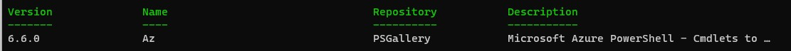

--- 

title: "How setup Powershell for Azure" 

date: 2021-12-02T17:22:08+01:00 

draft: false 

comments: true 

images:

--- 

 If you are using the Azure Cloud shell, you already have a useful powershell environment setup for you there by Microsoft...

 But it's not that unusual that employers want to keep all your code in a repo that is company controlled and where your teammates can access your files, and that repo may not always be directly accessible from the cloud shell.

 For that purpose, you might want to setup your own Powershell environment on the computer you work from. I'll go through this step by step in a series of tiny blog posts.

 ## Installing Powershell 7
 Getting and installing the package is a bit different depending on Operating system, but Microsoft have you covered for many of the flavours. Just choose your flavour in this [link](https://docs.microsoft.com/en-us/powershell/scripting/install/installing-powershell?view=powershell-7.2) and follow the instructions.

 ## Getting the Az Powershell module
 Installing a Powershell module is easy and can be done in more than one way. I suggest you try a multi step approach if you are new to powershell and not too sure of what you are doing.

 Open up Powershell and type:

 `Find-Module -Name Az`

 You should get something like this:

Now you know that the correct module was found in the PSGallery.

Now go ahead and install the module, since we know that the Find-Module command returned the exact module that we wanted, we can take the output from Find-Module and send it through the pipeline (|) to the Install-Module command. We'll add the -Scope parameter and set the scope to CurrentUser, that way we avoid any need to elevate our privileges to install the module.

`Find-Module -Name Az | Install-Module -Scope CurrentUser`

Sometimes there are commands that conflict, then you might need to add the -AllowClobber and -Force parameters

`Find-Module -Name Az | Install-Module -Scope CurrentUser -AllowClobber -Force`

Powershell will tell you that the repository is untrusted since psgallery is not configured to be trusted (and they are damn right, don't trust everything in there!). Powershell asks you to confirm that you want to continue with installation of the module, press "a" to go on.

The installation will take a while and when it's done it should look like this, with no errors.

Now you can connect to Azure:

`Connect-AzAccount`

A web browser will open and you will be asked to authenticate to Azure.

Once you are authenticated you can start exploring the Powershell commands in the Az module.

To list the commands of a module (in this example the Az.Resources module) you can type:

`get-command -Module Az.Resources | more`

Please note that the Az module is a compilation of many modules, that's why this example just takes the commands in the Az.Resources module.

**Happy Powershelling and stay tuned for the next blogpost!**

/TheAutomationDude

